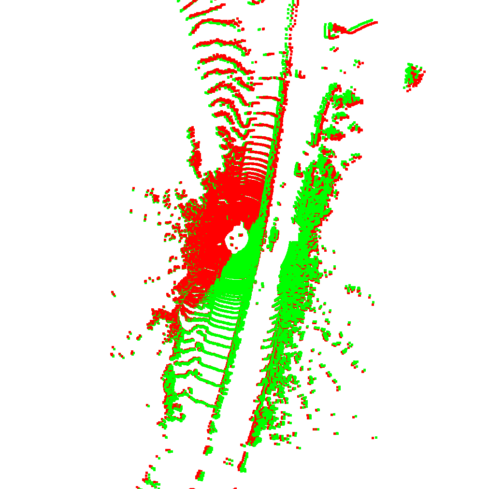
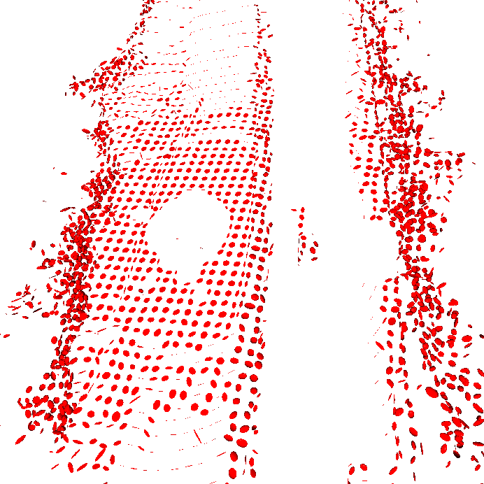

# NDT-3D (Normal Distributions Transform in PyTorch)

This repository provides a **PyTorch implementation of 3D Normal Distributions Transform (NDT) registration** for point clouds.  
To the best of our knowledge, this is the **first public Torch-based implementation** of NDT for 3D scan alignment.

The implementation has been tested on the **[KITTI Odometry dataset](http://www.cvlibs.net/datasets/kitti/eval_odometry.php)** with Open3D visualization.

---

## 🚀 Features
- Full **PyTorch** pipeline (GPU support).
- **Voxelized Gaussian model** for efficient likelihood computation.
- Gradient-based **SE(3) pose optimization**.
- Compatible with KITTI dataset format.
- Utilities for:
  - KITTI parsing (`kitti_dataset.py`)
  - Map building & subsampling (`create_map.py`)
  - Random transformations for benchmarking
- Open3D visualizations of:
  - Before vs. After registration
  - Built Gaussian means

---

## 📂 Project Structure
. <br />
├── create_map.py          # Build and subsample maps from KITTI scans <br />
├── demo_ndt.py            # Demo script: apply random transform & register scans <br />
├── kitti_dataset.py       # KITTI Odometry dataset loader & trajectory tools <br />
├── requirements.txt       # Python dependencies <br />
│ <br />
└── ndt/ <br />
&emsp;├── kdtree.py          # KD-tree wrapper (torch_kdtree backend) <br />
&emsp;├── ndt.py             # Core NDT model & registration optimizer <br />
&emsp;├── se3.py             # SE(3) exponential map & point transforms <br />
&emsp;└── __init__.py <br />

 

---

## 📊 Results

### Before Registration


### After Registration


### Built Gaussian Components


---

## 🔧 Installation
```bash
git clone https://github.com/yourusername/ndt-torch.git
cd ndt-torch
pip install -r requirements.txt


```

## 🔧 Dependencies

The minimal requirements are listed in [`requirements.txt`](requirements.txt):

- torch>=2.1
- numpy>=1.24
- **Open3D** → 3D point cloud visualization & voxel downsampling  
- **Matplotlib** → 2D plotting (trajectories, scan maps)  
- **[torch_kdtree](https://github.com/thomgrand/torch_kdtree)** → fast KD-tree nearest-neighbor search on GPU

## ▶️ Usage

### 1. Prepare the KITTI Dataset
- Download the [KITTI Odometry dataset](http://www.cvlibs.net/datasets/kitti/eval_odometry.php).
- Place it under a folder named `kitti/` (or adjust the `data_path` variable in the scripts).
### 2. Run the Demo
The demo applies a random rigid transformation to a scan and then aligns it back using NDT:
```bash
python demo_ndt.py
```
### ⚙️ Adjust Settings

You can fine-tune the experiment by editing parameters inside `demo_ndt.py`:

- **Dataset Path**
  ```python
  data_path = './kitti/'
  ```
    By default the demo uses sequence `'01'`. You can replace it with another KITTI sequence (for example `'00'`, `'02'`, etc.) depending on which dataset sequence you want to load.

  ```python
   sequence = '01'
  ```
- ** Optimization hyperparameters (learning rate, max iters, tolerance)**

## 📖 References

- M. Magnusson. *The Three-Dimensional Normal-Distributions Transform — an Efficient Representation for Registration, Surface Analysis, and Loop Detection.* PhD Thesis, Örebro University, 2009.  
- KITTI Odometry Benchmark: http://www.cvlibs.net/datasets/kitti/eval_odometry.php  
- torch_kdtree (GPU KD-tree library used in this project): https://github.com/thomgrand/torch_kdtree


